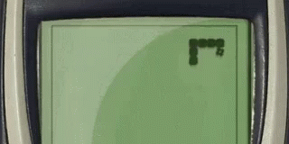

# :snake: Snake game :snake:

The classic **snake game**, created using JavaScript, and HTML5 canvas.<br>
See the original tutorial [here](https://www.educative.io/blog/javascript-snake-game-tutorial).<br>


## Step 1. Display the board and a still snake
### 1-1. Use a `<canvas>` element to draw graphics with JavaScript.
the `<canvas>` element is initialized to a 400 x 400 white rectangle
### 1-2. Make the canvas
    ```
    const snakeboard = document.getElementById("gameCanvas");
    const snakeboard_ctx = gameCanvas.getContext("2d");
    ```
### 1-3. Make the static snake
 - Specify the initial location of our snake on the canvas by representing the snake as an array of coordinates.
 - To create a horizontal snake in the middle of the canvas, at (200, 200), we list the co-ordinate of each body part of the snake.
    ```
    let snake = [  {x: 200, y: 200},  {x: 190, y: 200},  {x: 180, y: 200},  {x: 170, y: 200},  {x: 160, y: 200},];
    // The very first coordinate represents the snake’s head.
    ```
    
- To display the snake on the canvas, we can write a function to draw a rectangle for each pair of coordinates.

## Step 2. Make the snake move automatically
### 2-1. declare a function to make snake move horizontally 
    ```
    function move_snake() {
      const newHead = { x: snake[0].x + dx, y: snake[0].y };
      snake.unshift(newHead);
      snake.pop()
    }
    ```
### 2-2. Declare a function to make snake move vertically
    ```
    const newHead = { x: snake[0].x + dx, y: snake[0].y + dy };
    ```
### 2-3. Automatic movement
- Create one function `main`, and call it over and over again.
- inside `main`, use `setTimeout` to add a slight delay between each movement.
- Don't forget to call `drawSnake` each time after move_snake.
Up until now, the snake starts to move if we set dx to 10 and dy to 0. But it would move out of the canvas instead of turning. We need to figure out how to control directions!


## Step 3. Using arrow keys to change the snake’s direction
- Change direction
  - Use this [website](https://docstore.mik.ua/orelly/webprog/DHTML_javascript/0596004672_jvdhtmlckbk-app-b.html) to find the keyboard key code values for the arrow keys.
  - store the direction where the snake is currently going.
  - Create a `change_function` function. First, check if the snake is moving in the opposite direction of the new, intended direction. Then, change the `dx`, `dy` to assign a new direction.
  - use `addEventListner` on the document to listen for when a key is pressed, then call the `change_function` with `keydown` event
- Add bounary condition
  - To prevent our snake from moving infinitely, we make the function has_game_ended, which returns true when the game has ended and false if otherwise.
  - Two cases in which the game can end:
    1. The head of the snake collides with its body.
    2. The head of the snake collides with the canvas boundary.

## Step 4. Incorporate food and score
- Food
  - For the food that our snake will eat, we want to generate a random set of coordinates.
  - Make sure that the food is not located where the snake currently is.
  - Create a function to actually draw the food on the canvas and update main to incorporate the `drawFood` function.
- Grow the snake
  - The snake will grow whenever the head of the snake is at the same position as the food. Instead of adding a body part to the snake’s body every time that happens, we can skip removing a body part in the `move_snake` function.
- Score
  - Initialize a `score` variable and increment it every time the snake eats the food. 
  - To display the score, we will need a new `div` before the canvas.

:100: Now you have a fully functional snake game! :100:

**Now it's time to get creative!**

### CSS Tricks
1. To center an element in a its parent element using position absolute
```
#targetElement {
  position: absolute;
  top: 50%;
  left: 50%;
  transform: translate(-50%, -50%); 
}
```